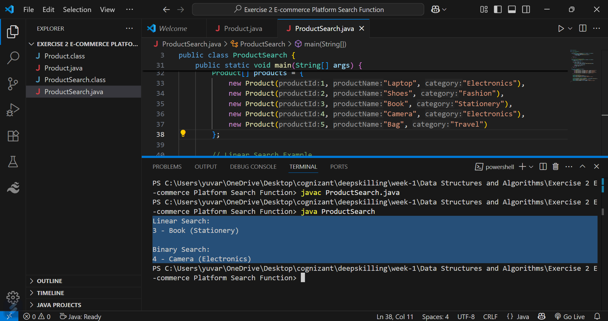

# 🚀 Exercise 2: E-commerce Platform Search Function

## 🧠 Step 1: Understand Asymptotic Notation

### ➤ What is Big O Notation?

Big O notation is used to describe the **time complexity** or **space complexity** of an algorithm. It helps to measure algorithm performance as input size grows.

### ➤ Best, Average, and Worst-Case Scenarios:

| Search Type      | Best Case | Average Case | Worst Case |
|------------------|-----------|--------------|------------|
| Linear Search    | O(1)      | O(n)         | O(n)       |
| Binary Search    | O(1)      | O(log n)     | O(log n)   |

---

## 🛠️ Step 2: Setup

- Create a `Product` class with the following attributes:
  - `productId`
  - `productName`
  - `category`

---

## 💻 Step 3: Implementation

- Implement **Linear Search**:
  - Works on any array
  - Searches each element one by one

- Implement **Binary Search**:
  - Requires a **sorted** array
  - Divides the search range by half each time

---

## 📊 Step 4: Analysis

### ➤ Time Complexity:

| Algorithm      | Time Complexity | Requirements             |
|----------------|------------------|---------------------------|
| Linear Search  | O(n)             | Works on unsorted array  |
| Binary Search  | O(log n)         | Requires sorted array    |

### ➤ Recommendation:

- For **small or unsorted** datasets, Linear Search is acceptable.
- For **large and sorted** product datasets (like in real e-commerce platforms), Binary Search is more efficient and scalable.

---

## 📷 Output Screenshot

---

